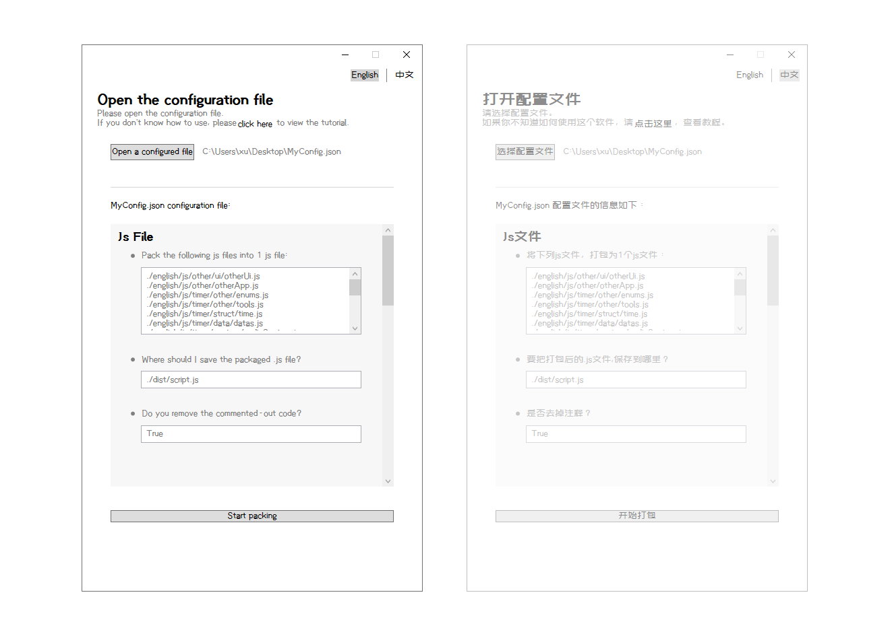
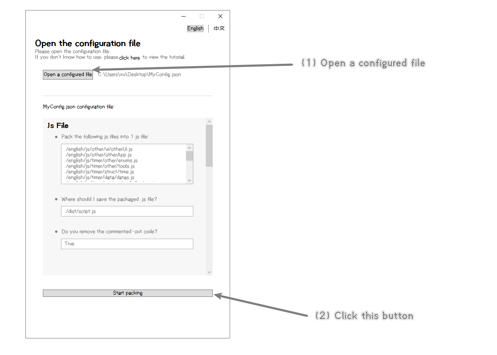

# Easy Pack Web Project Tool

This is a very simple tool,

This tool is used to package Web projects (Html files, Css files, Js files).

点击这里查看[中文文档](./document/README - [CN].md)



<br/>

## What is the use of this tool?

This tool has the following functions:

- **Multiple .js** files can be packaged into **one .js** file
- And remove the commented-out code in the .js file

<br/>

- **Multiple .css** files can be packaged into **one .css** file
- And remove the commented-out code in the .css file
- And export the files (image files, font files, etc.) in .css to the corresponding folder, and automatically modify the path in the .css file
- And you can automatically change the file in .css to a string in base64 format

<br/>

- Remove the commented-out code in the .html file

<br/>

<br/>

<br/>

## Download

Click here to download：https://github.com/xujiangjiang/Easy-Pack-Web-Project-Tool/releases/download/v1.0.0/EasyPackWebProjectTool.v1.0.0.zip

<br/>

<br/>

<br/>

## How to use?

#### Step 1: Write the configuration file

First, we have to create a text file in .json format *(for example: MyConfig.json)*. This .json file is the configuration file.

Then, we have to set it like this in this configuration file:

[（You can also click here to view a complete configuration file）](./document/asset/example.json)

```json
{

	//Package js file
    "js":{
        //Which .js files should be merged into one .js file?（Relative path, relative to the path of this configuration file）（Starting from the first js, package in order）
        "filePaths":["./js/other/ui/otherUi.js",
                     "./js/other/otherApp.js",
                     "./js/timer/other/enums.js",
                     "./js/timer/other/tools.js",
                     "./js/timer/struct/time.js"],
        //Where should I save the packaged .js file? (Relative path, relative to the path of this configuration file)
        "outputPath":"./dist/script.js",
        //Do you want to remove the commented-out code in the .js file?
        "isDeleteCommentedOutCode":true
    },

    //Package css file
    "css":{
        //Which .css files should be merged into one .css file?（Relative path, relative to the path of this configuration file）（Starting from the first css, package in order）
        "filePaths":["./css/timer/other/font.css",
                     "./css/timer/other/initial.css",
                     "./css/other/style/main.css",
                     "./css/other/style/logo.css"],
        //Where should I save the packaged .css file? (Relative path, relative to the path of this configuration file)
        "outputPath":"./dist/style.css",
        //Do you want to remove the commented-out code in the .css file?
        "isDeleteCommentedOutCode":true,
        //Do you want to export image files (and other files)?
        "isOutputOtherFile":true,
        //The export location of the image files (and other files) (Note: this is a folder, it must be a relative path, which is relative to the Css.OutputPath property)
        "otherFileOutputPath":"./img/",
        //Do you want to automatically convert the file to a base64 string?
        "isOtherFileConvertBase64":true,
        //When the file is smaller than how much, convert this file to base64 string? (Unit: B)
        "base64ConvertLimit":10240
    },
    
    //Package html file
    "html":{
        //Which .html file is to be packaged? (Relative path, relative to the path of this configuration file)
        "filePaths":"./src/myHtml.html",
        //Where should I save the packaged .html file? (Relative path, relative to the path of this configuration file)
        "outputPath":"./dist/index.html",
        //Do you want to remove the commented-out code in the .html file?
        "isDeleteCommentedOutCode":true
    },

}


```

<br/>

<br/>

#### Step 2: Open the tool

First, open the configuration file we just wrote.

Then, click the start packing button, and that's it!




