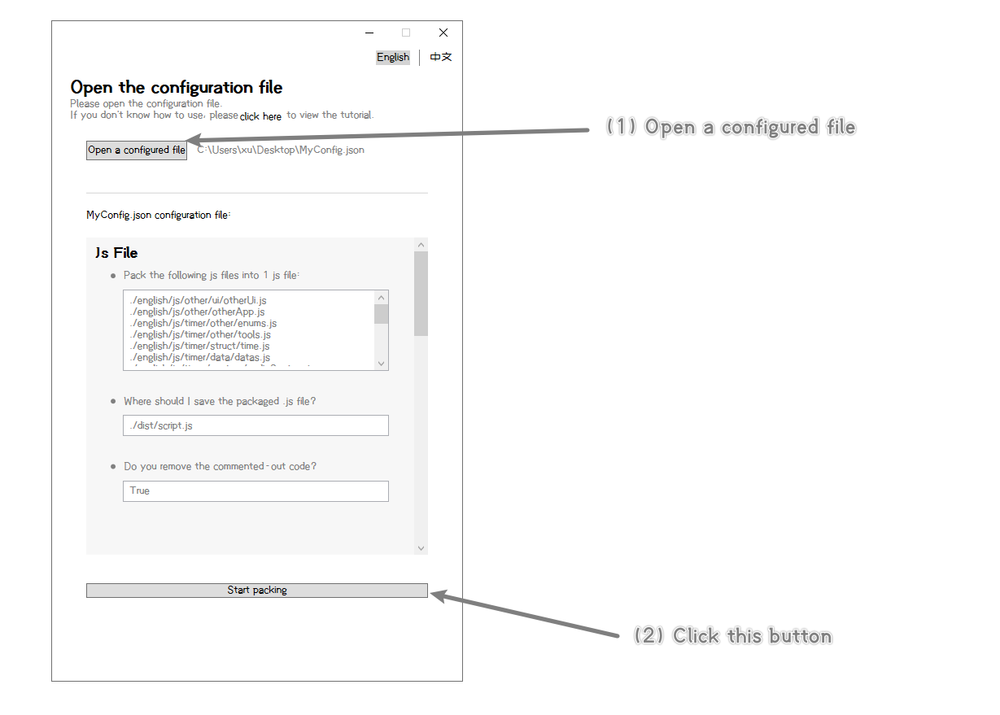

# Easy Pack Web Project Tool

这是1个很简单的工具，

这个工具用于把Web项目（Html文件、Css文件、Js文件），进行打包。


<br/>

## 这个工具有什么用？

这个工具有以下几个作用：

- 可以把多个.js文件，打包成1个.js文件
- 并且去除.js文件中的注释

<br/>

- 可以把多个.css文件，打包成1个.css文件
- 并且可以去除.css文件中的注释
- 并且把.css中的文件（图片、字体等），导出到对应的文件夹，并且自动修改.css文件中的路径
- 并且可以把.css中的文件，自动改为base64格式的字符串

<br/>

- 可以去除.html文件中的注释
- 并且把.html中的文件（图片、字体等），导出到对应的文件夹，并且自动修改.html文件中的路径
- 并且可以把.html中的文件，自动改为base64格式的字符串

<br/>

<br/>

<br/>

## 如何使用？

#### 第1步: 书写配置文件

首先，我们要创建1个.json格式的文本文件*（比如：MyConfig.json）*，这个.json文件，就是配置文件。

然后，我们要在这个配置文件中，这样设置一下：

[（你也可以点击这里，查看一个完整的配置文件）](./asset/example.json)

```json
{

	//打包js文件
    "js":{
        //要把哪些.js文件，合并成1个.js文件？（相对路径，相对于这个配置文件的路径）（从第1个js开始，按照顺序进行打包）
        "filePaths":["./js/other/ui/otherUi.js",
                     "./js/other/otherApp.js",
                     "./js/timer/other/enums.js",
                     "./js/timer/other/tools.js",
                     "./js/timer/struct/time.js"],
        //要把打包后的.js文件，保存到哪里？（相对路径，相对于这个配置文件的路径）
        "outputPath":"./dist/script.js",
        //是否要去掉.js文件中的注释？
        "isDeleteCommentedOutCode":true
    },

    //打包css文件
    "css":{
        //要把哪些.css文件，合并成1个.css文件？（相对路径，相对于这个配置文件的路径）（从第1个css开始，按照顺序进行打包）
        "filePaths":["./css/timer/other/font.css",
                     "./css/timer/other/initial.css",
                     "./css/other/style/main.css",
                     "./css/other/style/logo.css"],
        //要把打包后的.css文件，保存到哪里？（相对路径，相对于这个配置文件的路径）
        "outputPath":"./dist/style.css",
        //是否要去掉.css文件中的注释？
        "isDeleteCommentedOutCode":true,
        //是否导出图片（和其他文件）？
        "isOutputOtherFile":true,
        //图片（和其他文件）的导出位置（注意：这是一个文件夹，必须是相对路径，是相对于Css.OutputPath属性的路径）
        "otherFileOutputPath":"./img/",
        //是否要把文件自动转换为base64字符串？
        "isOtherFileConvertBase64":true,
        //文件小于多少时，就转换为base64字符串？（单位：B）
        "base64ConvertLimit":10240
    },
    
    //打包HTML文件
    "html":{
        //要处理的是哪个.html文件？（相对路径，相对于这个配置文件的路径）
        "filePaths":"./src/myHtml.html",
        //要把打包后的.html文件，保存到哪里？（相对路径，相对于这个配置文件的路径）
        "outputPath":"./dist/index.html",
        //是否要去掉.html文件中的注释？
        "isDeleteCommentedOutCode":true,
        //是否导出图片（和其他文件）？
        "isOutputOtherFile":true,
        //图片（和其他文件）的导出位置（注意：这是一个文件夹，必须是相对路径，是相对于Css.OutputPath属性的路径）
        "otherFileOutputPath":"./img/",
        //是否要把文件自动转换为base64字符串？
        "isOtherFileConvertBase64":true,
        //文件小于多少时，就转换为base64字符串？（单位：B）
        "base64ConvertLimit":10240
    },

}
```

<br/>

<br/>

#### 第2步: 打开工具

首先，选择我们刚刚写好的配置文件。

然后，点击开始打包按钮，就可以啦！




